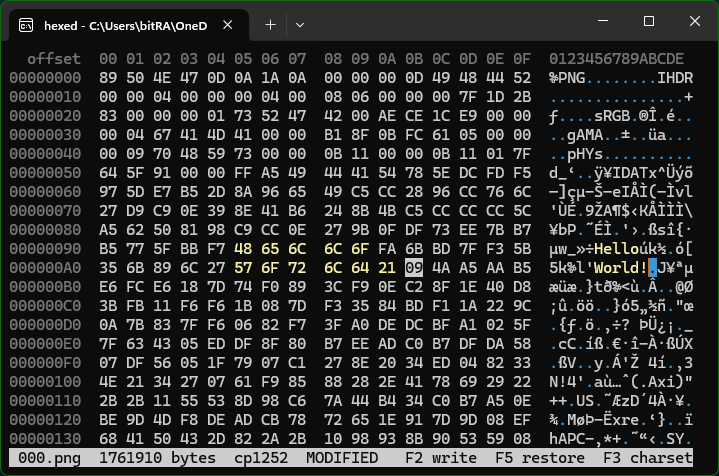

[](screenshot.png)

# hexed

A console hex editor on modern VT, built from `fasm2/examples/conio` and
carried onto the `fasm2_calm` projection and MS64 NEWCOFF, the same trajectory
as the sibling `controls/` tree.

```
fasmg -> MS64 NEWCOFF bigobj -> link -> PE64        12,288 bytes, kernel32 only
```

```cmd
hexed <file>
```

Existing files only. Bytes are edited in place; nothing is inserted, deleted,
or appended, and the file is never resized. The PE subsystem version is 10.0,
so the supported operating-system range is late Windows 10 and Windows 11.

## Build

From a Visual Studio developer prompt (`VsDevCmd.bat -arch=amd64
-host_arch=amd64`), so `link.exe` and the x64 SDK import libraries are on
`PATH`:

```cmd
nmake
nmake verify
nmake clean
```

`fasmg.exe` is driven directly rather than through `fasm2.cmd`: the wrapper
pre-includes `fasm2.inc`, which already carries `dd`/`align`/`format`/`x86-2`,
and `common/policy.g` includes those itself. Linker options are emitted by
`hexed.asm` through `virtual as "response"`, so they sit beside the code that
depends on them.

## Keys

| | |
| --- | --- |
| `←` `→` | byte within the view; stop at its ends |
| `↑` `↓` | row; at the top or bottom row, scroll the view by one |
| `PgUp` `PgDn` | a screenful |
| `Home` `End` | start / end of the row |
| `Ctrl+Home` `Ctrl+End` | start / last page of the file |
| `Tab` | hex pane ↔ ASCII pane |
| `F3` | next single-byte code page in the baked shortlist |
| `0`–`9` `A`–`F` | type a nibble (hex pane) |
| printable | type a byte (ASCII pane) |
| `F2` | write pending changes |
| `F5` | restore pending changes from the file |
| wheel, left click | scroll three rows, place the cursor |
| `Esc` `Esc` | leave |

## What an edit can reach

This is the property the program is built around, so it is worth stating
precisely.

**The view is the entire editable surface.** The rows on screen are also the
region read from the file, the only region a keystroke can change, and the only
region a write can touch. Three mechanisms hold that together, and none of them
is a check that could be forgotten:

1. **Edits are bounded by construction.** Typing writes `view[cur]`, and `cur`
   is clamped to `[0, view_bytes)`. It cannot be moved outside the view by
   anything except a navigation request.

2. **A write is bounded by construction.** `view_commit` seeks to
   `view_off + chg_lo` and writes `chg_hi - chg_lo + 1` bytes. Both ends are
   indices into the view, so the range is inside the view by arithmetic rather
   than by policy. Bytes the user did not touch are not rewritten at all.

3. **Navigation is gated.** Every change of `view_off` in the program goes
   through `nav_request`, which refuses to proceed while the view differs from
   the file and asks instead:

   ```
    changes pending in this view:  W write   R restore   Esc cancel
   ```

   The request is stored and replayed once the user answers. A resize is a
   navigation request too — it rebuilds the view — and takes the same prompt
   without the cancel a resize cannot honour.

Two consequences worth noticing. First, a keystroke can never modify a byte
that was not on screen when it was pressed, and leaving a screen with unsaved
work is always a decision rather than an accident. Ctrl and Alt chords are
refused by the data-entry path outright, so a mis-typed chord is a no-op rather
than a silent edit. Second — and this is what keeps the implementation small —
because navigation cannot proceed while changes are pending, `view_load` may
re-read from the file unconditionally: there is never an unwritten byte for a
reload to discard. The program needs no shadow document.

The pending change set is not a dirty map. It is the difference between `view`
(what is displayed) and `orig` (what the file holds), recomputed by a scan after
each keystroke. The same comparison decides what the screen colours and what a
write would commit, so the two cannot disagree, and retyping a byte's original
value clears the pending state, as it should.

Ctrl+Break and window close are the one path that does not ask: the handler
restores the terminal and exits, discarding pending changes. There is nowhere to
put the question, and discarding leaves the file exactly as it was.

## Display

`conio` spends its effort displaying events. This spends it on displaying a
document cheaply while the user moves through it.

**One event, one write.** Every routine in `paint.asm` composes into a shared
buffer and returns without writing. The event loop writes `[obuf,RDI)` once and
resets `RDI` before waiting again. A console program that writes per fragment
spends most of its time in the console host, and it shows the moment a key is
held down. The `<| ... |>` notation carried over from `conio/console.inc`
appends a pooled constant fragment at `RDI`; the companion `<<...>>` form, which
writes on the spot, is deliberately *not* carried over, because a routine that
writes on its own breaks the rule everything else is built on. The XTWINOPS
resize is the single sequencing exception: it drains before the legacy resize
and readback so they observe the request.

**Damage, not redraw.** A full repaint is the exceptional case:

| entry point | cost | when |
| --- | --- | --- |
| `paint_cells` | two byte cells + status, ~90 bytes | cursor moved, byte typed |
| `paint_scroll` | one `SU`/`SD` + the rows it exposed + two cells | one- or few-row scrolling |
| `paint_rows` | a row range + status | a write or restore landed |
| `paint_status` | the last line | pane toggle, a note |
| `paint_full` | everything | resize, page move, goto, charset |

The two cells in `paint_scroll` are not an afterthought. The terminal moves the
cursor's highlight along with everything else it scrolls, so after the region
scroll the reverse-video cell is one scroll away from where it belongs: stale
at the old screen position, missing at the new one. The byte that *should*
occupy the stale position is exactly `cur - delta*BPR`, so repainting that cell
and the cursor's own puts both right. Only the cursor is ever at stake, because
scrolling is refused while anything is changed.

Arrow-key navigation — by far the most common thing the user does — repaints
exactly two byte cells in both panes. Scrolling sets `DECSTBM` over the data
rows once and then asks the terminal to scroll the region, drawing only the
newly exposed row; the addresses in the address column move with the content
they belong to, which is what makes a hex dump scrollable this way at all.

**SGR runs, not SGR per cell.** `render_row` asks `emit_attr` for an attribute
class per byte, and `emit_attr` emits nothing unless the class differs from the
one already in effect. An ordinary row therefore costs one colour change for the
address and one reset for the whole 76 columns; a row carrying the cursor costs
four more. Every sequence starts from `0` so classes never have to be unwound in
order.

The terminal's own cursor is parked on the nibble being edited at the end of
each frame, so the caret the user is watching is the real one.

## The right-hand pane

The console output code page at startup is the initial byte interpretation when
it is single-byte. This makes the shell part of the workflow:

```cmd
chcp 866 >nul
hexed file
```

`hexed` captures that page, prepends it to the favourites baked into
`HEXED_CODEPAGES` in `hexed.h`, drops multibyte, unavailable and duplicate
entries, and makes `F3` cycle only the resulting shortlist. The shipped
favourites are 437, 850 and 1252; when the console starts in UTF-8, 437 is the
fallback. Edit the one definition to fit the local workflow.

On every selection, `GetCPInfoExW` verifies an SBCS and
`MultiByteToWideChar` builds a 256-entry Unicode map with glyph characters
enabled. There is no embedded CP437 table. This is the `charbyte` idea
(bitRAKE/charbyte) applied to the dump without carrying every possible table in
the executable.

Mappings rejected by Windows, and mappings that remain Unicode C0 or C1
controls, are drawn as cyan dots rather than sent to the terminal. OEM graphic
forms exposed by `MB_USEGLYPHCHARS` remain visible. The colour is a class bit
alongside "changed" and "under the cursor", and `emit_attr` composes the escape
sequence from those bits rather than looking one up.

Glyphs are emitted as UTF-8, so the output code page is switched to UTF-8 after
the startup page is captured and restored on exit. The footer names the active
mapping numerically (`cp437`, `cp850`, and so on).

## The footer, and what is left behind

The footer carried the cursor's offset, the byte under it and that byte's
character. All three are read off the view — the cursor is highlighted, the
address heads its row, the character is in the right-hand pane — so restating
them cost a line and told nobody anything. It now carries what the view cannot
say: which file, how big, how the right-hand pane is being read, and whether
what is on screen matches the disk.

It is drawn reversed and padded to the window edge so it reads as a bar. `ESC[K`
is not enough on its own: it erases with the current background colour, and
reverse video is an attribute rather than a colour, so the bar ended where its
text ended — measured at `attr[0] = 0x4007`, `attr[75] = 0x0007`. Nothing
between the bar's first column and its last emits an escape sequence, so bytes
written are columns used and the line can be squared off exactly. The prompt
takes the whole line in yellow-on-black: a question about unwritten data should
not look like the thing it replaces.

One line outlives the alternate screen buffer:

```
hexed: C:\path\file.bin: 1 byte written
hexed: C:\path\file.bin: unchanged
hexed: C:\path\file.bin: unchanged, 3 pending bytes DISCARDED
```

Everything the editor knew was on a screen that is torn down on the way out, so
leaving without a word means the session's only lasting question — did this
change the file? — is answered nowhere. The third form is the Ctrl+Break and
window-close path: those cannot stop to ask, so they drop pending changes.
Dropping them is the safe direction; dropping them quietly is not.

## Geometry

76 columns, sixteen bytes to the row, one fixed arrangement:

```
  offset  00 01 02 03 04 05 06 07  08 09 0A 0B 0C 0D 0E 0F  0123456789ABCDEF
00000000  48 69 21 0A FF                                    Hi!..
```

**The width is the program's; the height is the user's.**

Sixteen bytes to the row is what a hex dump means, and reflowing to eight would
silently change every address on screen. There is nothing useful to do with a
wider window and nothing honest to do with a narrower one, so the width is not
negotiated: it is read at start, held at 76 while running, and put back on exit.
A window opened at 120 columns becomes 76; drag it wider and it comes back.

The mechanism is `CSI 8 ; rows ; cols t` — the terminal's own resize, sent down
the same output stream as everything else. The startup window extent is saved;
after leaving the alternate buffer, the same terminal request restores both
original dimensions. That symmetric VT request is required because changing a
ConPTY screen buffer does not resize its owning terminal window. The alternatives
are worth naming because they look like they should work:

- `SetConsoleWindowInfo` / `SetConsoleScreenBufferSize` are the legacy path.
  Over ConPTY the terminal owns the window; a buffer change is accepted and then
  reverted, so the size flickers and returns. They are still called after the VT
  request, for a host that predates it.
- `GetConsoleWindow` does return a handle, but under ConPTY it is a
  `PseudoConsoleWindow`: 0×0, owned by the console process itself rather than by
  the terminal. `SetWindowPos` on it succeeds and resizes nothing. Measured, not
  assumed. Where that handle *is* a real `ConsoleWindowClass`, the console API
  above already works, so the HWND route is never the one that helps — and it
  would cost a user32 dependency to find that out.

If a host honours none of them, a window at least 76 wide is simply used from
its left edge, and only a genuinely narrower one is reported. Asking twice for a
width the host already declined would spin — a terminal that owns its size
reasserts it and the two would trade resizes forever — so each width is
attempted once.

Height carries a minimum (ruler, a row, status) and **no maximum**: the view is
however many rows the window has. That is why the buffers are sized from the
geometry at run time rather than from a constant — `arena_fit` grows the single
allocation to fit and carves it three ways, so a taller window is a bigger read
rather than a truncated view. The arena only grows, so dragging a window taller
and shorter again does not churn. Out of memory is the only thing that puts a
ceiling on the height, and when it does the view is cut to what the arena in
hand can hold and says so.

**Nothing is painted until a `WINDOW_BUFFER_SIZE_EVENT` arrives** — the first
record the console delivers after the switch to the alternate screen buffer.
That makes one path (apply geometry, load the view, repaint) responsible for
both startup and every later resize, and removes the startup special case
entirely. It is also a real dependency: a host that never sends that record
would leave the screen blank.

That event reports `dwSize`, which is the *buffer*, and a buffer can be taller
than the window it is shown through and can sit anywhere within it. The two
coincide in the alternate screen buffer, but coinciding by convention is not the
same as being the same number, so the event is only a fallback: `read_window`
takes the extent from `srWindow` and the origin from `srWindow.Top`, and every
cursor address in `paint.asm` is placed from that origin.

Files of 4 GiB and over are refused. The address column is eight hex digits;
a ninth would cost the ASCII pane its column budget, and showing a wrong address
is worse than refusing the file.

## Layout

```
hexed/
  makefile
  hexed.h              geometry, HexState, and the contract between the objects
  hexed.asm            entry, command line, console setup/restore, event loop,
                       key and mouse dispatch, the navigation gate, response file
  view.asm             view load / commit / restore / rescan / clamp
  paint.asm            every escape sequence in the program
  common/
    policy.g           format, projection selection, PROC frames, section
    names.g            short spellings for projection values
    data_blocks.g      the CONST/DATA/BSS gatherers
    vt.g               the `<| ... |>` frame-fragment notation
```

The application thread owns its nonvolatile registers, as `conio` does.
`mainCRTStartup` sets `RBX` to the single `HexState` and `RBP` to the current
`INPUT_RECORD` once; neither is rediscovered by an internal routine. `RDI` is
the frame-buffer write pointer. The event loop writes `[obuf,RDI)` and resets
`RDI` to `obuf`, while `arena_fit` rebases it when an allocation moves. `RSI`
is the source cursor used by string scans and the `<| ... |>` fragment
notation.

Internal procedures do not save and restore registers already owned by the
program. Windows preserves them, and the entry point terminates through
`ExitProcess` rather than returning to a caller. Procedures that execute an ABI
call have an aligned static-RSP frame; output builders only call private leaves
and need no ABI call frame. The `emit_*` leaves take no frame: they make no
calls and cannot fault, so there is nothing for an unwinder to describe.

`ConsoleCtrlHandler` is the exception to the single-thread register contract:
Windows may enter it on another thread with unrelated register values. It
therefore reaches the quit event through the absolute `hex` object and relies
on none of `RBX`, `RBP`, `RSI` or `RDI`.

## Three things this tree was the first to hit

All three were found by building and running, and are noted where they bite.

**`data_blocks.g` produced a corrupt BSS.** NEWCOFF's intended declaration is
`section '.bss' readable writeable align 64`, with only uninitialized
declarations in that section. NEWCOFF has no `udata` attribute: when a section
has logical size but emitted no bytes, its finalizer derives
`IMAGE_SCN_CNT_UNINITIALIZED_DATA` and sets `PointerToRawData` to zero.

BSS must be a separate section. `VirtualSize` is reserved and must be zero in a
COFF object, so it cannot express a logical extent larger than an initialized
raw prefix as it can in a PE image. If initialized and reserved declarations
share an object section, NEWCOFF materializes the reserved tail as real zeros
instead.

The broken block was declared `section '.bss' data readable writeable`. The
`data` attribute sets `IMAGE_SCN_CNT_INITIALIZED_DATA`; `newcoffms.inc` then
*adds* `IMAGE_SCN_CNT_UNINITIALIZED_DATA` and sets `PointerToRawData` to zero
without clearing the first flag. The MS linker believes `INITIALIZED_DATA`,
reads the section's bytes from file offset 0 — the object's own header and
section table — and maps them where the program expects zeroed state. It does
not fault. It starts up holding whatever those bytes happen to say; here
`HexState.prompt` landed on the `.bss` section header's size field and read 204,
so the editor came up permanently displaying a prompt and ignoring every key.
Omitting `data` leaves the finalizer to derive the one correct flag.

`controls/common/data_blocks.g` carries the same line and has never had
anything in `□` to expose it.

**A `calminstruction ?` catch-all cannot be installed before a `struct`
declaration.** `struct` and `ends` move the whole `?` handler chain aside and
back (`mvmacro`/`mvstruc`); a catch-all present across that shuffle leaves field
declarations dispatching through the wrong handler, and the fields end up
defined twice — instantiating the struct then reports `definition of
'HexState.hInput' in conflict with already defined symbol`. The projection's
generated types are declared before any catch-all exists, which is why only
locally declared structs break. So `common/vt.g` is not included by `policy.g`;
a module declares its structures first and picks up the notation afterwards.
`conio` satisfies the same constraint by accident — `wincon.g` precedes the
`<<...>>` and `<|...|>` definitions in `console.inc`, and declares no structures
after them.

**Subsystem 10.0 normal launch requires load configuration metadata.** Merely
setting `/SUBSYSTEM:CONSOLE,10.0` made the loader reject the image with
`0xC000007B` before reaching `mainCRTStartup`; ASLR flags, base relocations and
x64 unwind metadata do not substitute for that directory. The
`_load_config_used` object is the 148-byte legacy prefix through `GuardFlags`.
It truthfully leaves the security-cookie and CFG pointers null and sets
`IMAGE_GUARD_SECURITY_COOKIE_UNUSED`; the linker publishes it as Load
Configuration Directory entry 10. This is the minimal normal-launch requirement
isolated by `fasm2/examples/ss10`.

## Verified

Driven in a live console by attaching to it and feeding `INPUT_RECORD`s
(`AttachConsole` + `WriteConsoleInput`), reading the screen back with
`ReadConsoleOutputCharacter`:

- the first event is `WINDOW_BUFFER_SIZE_EVENT` and the initial paint is correct
- arrow keys, `PgUp`/`PgDn`, `Home`/`End`, `Ctrl+Home`/`Ctrl+End`, wheel scroll
  and click-to-place all land on the offsets they should
- a wheel scroll of three rows leaves every row's address contiguous, so the
  region scroll and the exposed-row rendering agree
- typing in both panes; the byte updates in hex and ASCII, `mod` appears
- `PgDn`/`PgUp`/`Ctrl+End` are all refused while changes are pending, and the
  view does not move
- `Esc` cancels the prompt, `W` writes and then performs the deferred
  navigation, `R` restores and then performs it
- a resize with changes pending raises the forced prompt, `Esc` does not
  dismiss it, `W` writes and rebuilds at the new geometry
- width taken and held, height followed with no ceiling — driving the terminal
  with the same `CSI 8 t` the program uses:

  | asked for | window | view rows | last row address |
  | --- | --- | --- | --- |
  | startup, 120 wide | **76**×30 | 28 | `000001B0` |
  | 120×50 | **76**×50 | 48 | `000002F0` |
  | 76×64 | 76×64 | 62 | `000003D0` |
  | 100×34 | **76**×34 | 32 | `000001F0` |
  | on exit | **120**×30 | — | restored |

- a window below 76×4 says so and recovers when it grows
- a 5-byte file renders its partial row, and `End`/`↓` clamp to the last byte
- a read-only file shows `ro`, refuses typing, and leaves the file untouched
- **after each write the file differs in exactly the edited byte and no other**
- exit code 0, terminal and console modes restored
- scrolling leaves exactly one highlighted cell in the hex pane — checked by
  reading console *attributes* over the whole view after a wheel scroll in each
  direction and after a one-row up-scroll, which is the bug that prompted the
  two-cell repaint
- `F3` cycles the captured startup SBCS and baked favourites, skipping
  multibyte, unavailable and duplicate pages
- the footer is reverse video across all 76 columns (`attr[0] = attr[75] =
  0x4007`); the prompt is uniform `0x0060` and distinct from it
- the exit line reports `1 byte written` after a one-byte commit and
  `unchanged` after none, with the file matching in both cases

Not exercised: files at the 4 GiB boundary; hosts other than Windows Terminal
on Windows 11; and the `DISCARDED` branch of the exit line. That last one needs
a real Ctrl+Break or window close — `TerminateProcess` runs no handler, and a
Ctrl+Break reaches every process sharing the console, including the harness, so
the console is gone before it can be read. The write and unchanged forms of the
same line are verified, and the discarded count is computed on the same path.
